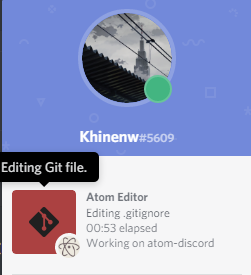
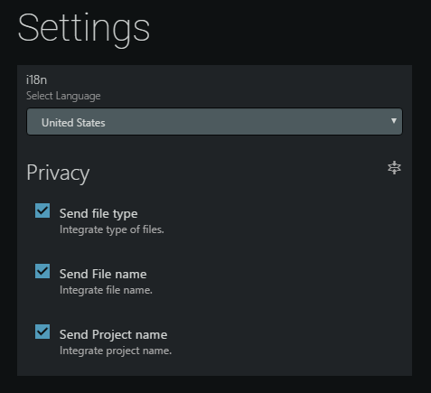

# atom-discord

Integrate your __atom__ with __Discord__ and show _Rich Presence_ information

## Installation
`$ apm install atom-discord`

## Warning
* You should add Atom to Discord game list to show rich presence.

## Screenshots

